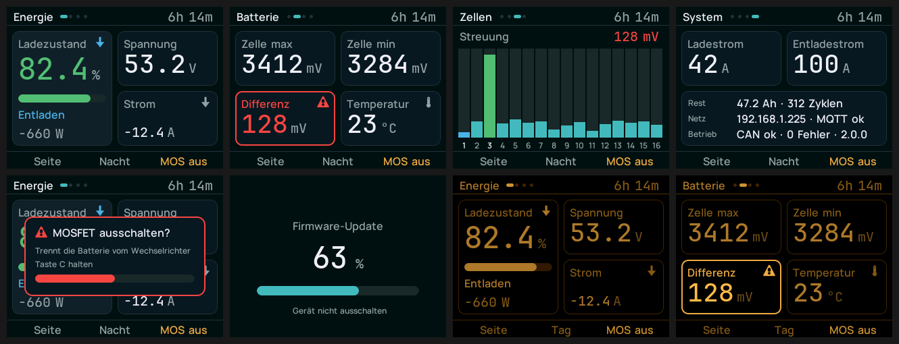

# SolisM5 — DALY-BMS zu SOLIS-Wechselrichter

Adapter zwischen einem **DALY/Deligreen Smart BMS** und einem **SOLIS-Hybrid-Wechselrichter**,
auf einem **M5Stack Core Basic** mit COMMU-Modul. Er liest das BMS über UART, regelt Lade-
und Entladestrom anhand der höchsten Zellspannung und meldet den Pylontech-kompatiblen
Datensatz im Sekundentakt über CAN. Optional hängt er an Home Assistant.

**[→ Firmware im Browser aufspielen](https://rubenmuehlhans.github.io/daly-solis-converter/)**
(Chrome oder Edge am Rechner)



Die Bilder sind keine Entwürfe, sondern direkt aus dem Bildspeicher des Geräts gelesen
(`tools/grab_screens.py`).

---

## Inhalt

- [Was es tut](#was-es-tut) · [Hardware](#hardware) · [Installation](#installation)
- [Konfiguration](#konfiguration) · [Bedienung](#bedienung) · [Home Assistant](#home-assistant)
- [Aus dem Quelltext bauen](#aus-dem-quelltext-bauen) · [Aufbau des Codes](#aufbau-des-codes)
- [Fallen](#fallen-die-sonst-zeit-kosten) · [Stand der Erprobung](#stand-der-erprobung) · [Herkunft](#herkunft-und-lizenz)

---

## Was es tut

Der SOLIS spricht mit seiner Batterie im Pylontech-Protokoll über CAN. Ein DALY-BMS
spricht das nicht. Dieser Adapter sitzt dazwischen:

- **Liest das BMS** (Registersatz `0x90`–`0x95`): Packspannung, Strom, SOC, höchste und
  niedrigste Zellspannung, Temperatur, MOSFET-Zustand, Restkapazität, Zyklen und alle
  16 Einzelzellen.
- **Regelt den Ladestrom** anhand der höchsten Zelle, nicht der Packspannung. Bei LiFePO4
  läuft die Packspannung bis kurz vor Schluss flach, während einzelne Zellen davonlaufen —
  wer nur auf die Packspannung regelt, überlädt genau die stärkste Zelle.
- **Sendet an den Wechselrichter** die Rahmen `0x351`, `0x355`, `0x356`, `0x35E`, `0x359`.
- **Meldet nach Home Assistant** über MQTT-Discovery: 40 Entities, inklusive Schalter für
  die MOSFETs und Sollwerten für die Stromgrenzen.
- **Zeigt alles auf dem Display** — vier Seiten, Tag- und Nachtansicht, Bedienung über die
  drei Tasten.

Die Regelung in Kurzform (alle Schwellen auf dem Mittel aus drei Messungen der **höchsten**
Zelle, einstellbar in [`main/app_config.h`](main/app_config.h)):

| Zellspannung | Was passiert |
|---|---|
| über 3410 mV | Ladestrom sinkt um 1 A alle 5 s, Erhöhen gesperrt |
| über 3430 mV | Ladestrom auf 20 A gedeckelt |
| **über 3460 mV** | **Ladestrom 0**, SOC im BMS auf 100 % kalibriert |
| über 3480 mV | harte Grenze, Ladestrom 0 unabhängig von allem anderen |
| unter 3350 mV | Laden wieder freigegeben, Start mit 5 A |
| unter 2700 mV (niedrigste Zelle) | Entladeende, SOC auf 10 % gezogen |

Dazu Deckel nach Ladezustand: über 95 % höchstens 50 A, über 99 % höchstens 20 A, über
99,5 % höchstens 5 A. Nach jedem Absenken bleibt das Erhöhen zehn Minuten gesperrt — sonst
pumpt die Regelung, sobald eine Wolke über die Anlage zieht.

---

## Hardware

| Was | Wohin |
|---|---|
| M5Stack **Core Basic** (oder Gray) | ESP32, ILI9342C 320×240, Tasten A/B/C |
| M5Stack **COMMU-Modul** | MCP2515 an SPI3/VSPI, CS GPIO 12, 500 kbit/s, 8-MHz-Quarz |
| DALY-BMS, UART | GPIO 5 (RX) / GPIO 2 (TX), 9600 8N1 |
| SOLIS, CAN | COMMU-CAN an Pin 4 (blau) und Pin 5 (weiß-blau) der Batteriebuchse |
| SD-Karte | CS GPIO 4, wird nur beim Start für `config.txt` gelesen |

> **⚠️ Pegelbegrenzung ist Pflicht.** Der DALY sendet 5-V-TTL, der ESP32 verträgt 3,3 V.
> Ohne Begrenzung (3,3-V-Z-Diode gegen Masse plus 1 kΩ in Reihe, am besten auf einem
> Proto-Modul) nimmt der M5Stack am UART Schaden.

> **⚠️ Das BMS schläft ein.** Ohne Stromfluss geht das DALY nach einer Stunde schlafen und
> antwortet nicht mehr. In der Bluetooth-App die Sleep Time auf `65535` setzen.

> **⚠️ Wechselrichter-Einstellungen.** Der SOLIS muss auf „User Battery“ stehen. Seine
> eigenen Ladeschlussspannungen müssen **höher** liegen als die hier gesendeten, damit
> dieser Adapter das Laden beendet und nicht der Wechselrichter.

Getestet gegen einen SOLIS RHI-4.6K-48ES-5G (Modell F2) an einem 16s-LiFePO4-Pack.

---

## Installation

### 1. Im Browser (am einfachsten)

**[rubenmuehlhans.github.io/daly-solis-converter](https://rubenmuehlhans.github.io/daly-solis-converter/)**

Braucht Chrome oder Edge am Rechner — Web Serial gibt es weder in Safari und Firefox noch
auf dem Telefon. Je nach Baujahr des M5Stack ist vorher ein Treiber für den seriellen
Wandler nötig ([CP210x](https://www.silabs.com/developers/usb-to-uart-bridge-vcp-drivers)
oder [CH9102](https://www.wch-ic.com/downloads/CH341SER_ZIP.html)).

Sobald es mehr als eine Version gibt, steht über dem Knopf eine **Versionsauswahl** —
voreingestellt ist die neueste. Alle Fassungen liegen unter
[Releases](https://github.com/rubenmuehlhans/daly-solis-converter/releases).

### 2. Fertiges Abbild mit esptool

```bash
pip install esptool
```

```bash
esptool.py --chip esp32 --port /dev/cu.usbserial-XXXX --baud 460800 write_flash 0x0 docs/firmware/solism5-v2.0.0.bin
```

Das Abbild in [`docs/firmware/`](docs/firmware) enthält Bootloader, Partitionstabelle und
Anwendung und wird ab Offset 0 geschrieben.

### 3. Aus dem Quelltext

Siehe [Aus dem Quelltext bauen](#aus-dem-quelltext-bauen).

### Danach: Funk-Updates

Ist das Gerät im WLAN, geht jedes weitere Update über espota — dasselbe Protokoll, das
ArduinoOTA benutzt:

```bash
python3 ~/.platformio/packages/tool-espotapy/espota.py -i <IP-des-Geräts> -f build/solism5.bin
```

Ein Fortschrittsbalken erscheint dabei auf dem Display. **Ohne Passwort** — wer im WLAN
ist, kann flashen.

---

## Konfiguration

Eine Datei `config.txt` im Wurzelverzeichnis der SD-Karte:

```
wifi_ssid=
wifi_password=
mqtt_ip=
mqtt_port=1883
mqtt_user=
mqtt_password=
```

Sie wird beim Start gelesen und zusätzlich in den internen Speicher (NVS) übernommen —
das Gerät startet danach auch ohne Karte. Die Karte wird nach dem Lesen wieder ausgehängt,
weil sie sich den SPI-Bus mit dem Display teilt.

Ohne WLAN und MQTT läuft der Adapter vollständig weiter. Netz ist nur für Home Assistant
und Funk-Updates nötig.

---

## Bedienung

| Taste | kurz | lang |
|---|---|---|
| **A** | nächste Seite | — |
| **B** | Tag-/Nachtansicht | 1 s: Signalton bei Lesefehlern an/aus |
| **C** | — | **1,5 s halten:** MOSFETs im BMS schalten |

Die MOSFET-Taste braucht bewusst einen Halte-Druck mit Fortschrittsanzeige — sie trennt
die Hausbatterie vom Wechselrichter, und der Knopf sitzt in Griffhöhe.

**Die vier Seiten:** Energie (Ladezustand groß, Füllbalken, Spannung, Strom, Leistung) ·
Batterie (höchste und niedrigste Zelle, Streuung, Temperatur) · Zellen (16 Balken auf enger
Skala — absolut betrachtet sehen alle Zellen gleich aus, interessant ist die Streuung) ·
System (Ströme, Restkapazität, Netz, Betriebszustand).

Die Statuszeile zeigt Störungen als farbige Pille — und **nur** dann. Eine Zeile voller
grüner Haken trägt keine Information und macht die eine rote Pille unsichtbar, auf die es
ankommt.

---

## Home Assistant

Das Gerät meldet sich selbst per MQTT-Discovery an, 40 Entities. Das Drahtformat bildet
die Arduino-Bibliothek **ArduinoHA 2.x** exakt nach, damit ein Umstieg von einer
ArduinoHA-Firmware die vorhandenen Entities samt Historie behält:

```
config : homeassistant/<sensor|switch|number>/<geräte-id>/<objekt>/config   retained
state  : aha/<geräte-id>/<objekt>/stat_t                                    retained
command: aha/<geräte-id>/<objekt>/cmd_t
```

> **⚠️ Die Geräte-ID ist eine feste MAC** in [`main/app_config.h`](main/app_config.h)
> (`HA_DEVICE_MAC`). Sie ist die Identität in Home Assistant — wer zwei Geräte baut, muss
> sie ändern, sonst überschreiben sie sich gegenseitig. Aus demselben Grund dürfen nie
> **zwei Adapter gleichzeitig** laufen: gleiche MQTT-Client-ID (der Broker wirft dann
> abwechselnd einen raus) und gleiche CAN-Rahmen-IDs.

Steuerbar aus Home Assistant: MOSFETs ein/aus, Neustart, SOC-Kalibrierung, maximaler Lade-
und Entladestrom.

---

## Aus dem Quelltext bauen

Gebaut mit **ESP-IDF 5.3.2**.

```bash
source ~/esp/esp-idf/export.sh
```

```bash
idf.py build
```

```bash
idf.py -p /dev/cu.usbserial-XXXX flash monitor
```

### Erzeugte Dateien

`main/gen/` ist **vollständig generiert und nie von Hand zu editieren** — Farben, Icons
und Schriften entstehen aus den Skripten in `tools/`:

```bash
python3 tools/gen_ds_colors.py       # Farben (+ --verify: Vergleichsseite für Chrome)
python3 tools/gen_icons.py           # Icons  (+ --png: Vorschau)
python3 tools/gen_vlw.py             # Schriften
```

Die letzten beiden brauchen `pillow`, `freetype-py` und `fonttools`.

- **Farbe ändern:** Palette in `tools/gen_ds_colors.py`, Skript laufen lassen. Im C-Code nichts.
- **Neues Zeichen im UI** (z. B. „∆“, „µ“): `CODEPOINTS` in `gen_vlw.py` ergänzen. Fehlt
  ein Zeichen im Font, **bricht der Generator hart ab** — sonst fällt die Lücke erst am
  Gerät auf.
- **Layout ändern:** nur `lay::` in `main/ui/theme.h` — alles rechnet daraus.

### Optik prüfen, ohne zu flashen

`tools/preview_ui.py` zeichnet dieselben Bildschirme am Rechner, mit denselben Schriften
und Maßen, und markiert Textüberläufe rot. Ersetzt den Gerätetest nicht — RGB565 und die
Eigenheiten von LovyanGFX sieht man nur am echten Panel —, fängt aber Überläufe früh ab.

### Echte Screenshots vom Gerät

```bash
idf.py -DSOLIS_SELFTEST=1 -p /dev/cu.usbserial-XXXX flash
```

```bash
python3 tools/grab_screens.py --port /dev/cu.usbserial-XXXX
```

Das Gerät spielt plausible Messwerte ein, zeichnet alle Screens durch und schiebt seinen
Bildspeicher base64-kodiert über die serielle Konsole (~150 s). Ergebnis in
`tools/shots_device/`. Danach **ohne** `-DSOLIS_SELFTEST=1` neu flashen — im Selbsttest
wird der BMS-Task gar nicht gestartet.

### Eine Version veröffentlichen

```bash
NOTES="Was in dieser Version neu ist" tools/release.sh 2.1.0
```

Das Skript baut, führt Bootloader, Partitionstabelle und Anwendung zu **einem** Abbild
zusammen, schreibt das Manifest, trägt die Version in `docs/versions.json` ein, committet,
taggt und legt das GitHub-Release samt Abbildern an.

Der Web-Flasher zeigt genau die Versionen, die in `docs/versions.json` stehen — deshalb
macht das Skript beides in einem Rutsch. Wer von Hand released, vergisst sonst eines von
beidem und der Flasher bietet die neue Fassung nicht an.

Die Abbilder liegen bewusst **im Repository** unter `docs/firmware/` und nicht nur an den
Releases: so lädt der Flasher alles vom selben Ursprung wie die Seite und hängt weder an
CORS-Kopfzeilen noch an API-Grenzen von GitHub.

---

## Aufbau des Codes

```
main/
  app_main.cpp     Start, Reihenfolge der Initialisierung, 50-Hz-Schleife
  model.h/.cpp     gemeinsamer Zustand + Kommando-Warteschlange  ← die Schnittstelle
  app_config.h     Verdrahtung, Regelparameter, Laufzeit-Konfiguration
  bms/daly.*       UART-Protokoll
  bms/control.*    Lade-/Entladeregelung
  bms/bms_task.*   Sekundentakt: lesen → regeln → prüfen → senden
  can/mcp2515.*    SPI-Treiber (nur senden)
  can/solis.*      Pylontech-Rahmen
  net/wifi.*       Station mit Wiederverbinden
  net/ha_mqtt.*    Discovery, Zustände, Kommandos
  net/ota.*        espota
  ui/theme.*       Layout + zwei Paletten
  ui/tiles.*       Kachel- und Hero-Rendering (ein Sprite)
  ui/pages.*       vier Seiten, Statuszeile, Tasten
  ui/screens.*     Start, Update, MOSFET-Bestätigung, Kurzmeldung
  gen/             generiert — nie von Hand editieren
```

Vier Aufgaben, vier Tasks: `bms` (Priorität 6) besitzt UART und CAN und taktet im
Sekundentakt; `ha` (3) spricht MQTT; `espota` (4) wartet auf Updates; der Haupt-Task (1)
zeichnet und liest die Tasten mit 50 Hz. Alles teilt sich genau einen Zustand
(`model.h`), gelesen als Kopie. UART und CAN gehören **ausschließlich** dem BMS-Task —
Anzeige und MQTT schicken Wünsche über eine Warteschlange. Das erspart jede Sperre um die
Schnittstellen.

---

## Fallen, die sonst Zeit kosten

- **⚠️ Chip-Select am geteilten SPI-Bus von Hand ziehen.** M5GFX schreibt in seinem
  `beginTransaction()` direkt `SPI_CS0_DIS | SPI_CS1_DIS | SPI_CS2_DIS` ins Register — es
  schaltet alle Hardware-CS-Leitungen ab, an der IDF vorbei. Der IDF-Treiber stellt seine
  Gerätekonfiguration laut eigenem Kommentar nur wieder her, „when the dev_id is changed“.
  Der MCP2515 zieht CS deshalb selbst per GPIO und hält `spi_device_acquire_bus()` über die
  ganze CS-Phase, sonst schiebt das Display mitten in ein Kommando Pixel auf den Bus.
- **⚠️ `spi_device_acquire_bus()` akzeptiert ausschließlich `portMAX_DELAY`.** Jede endliche
  Wartezeit gibt `ESP_ERR_INVALID_ARG`. Wer den Rückgabewert nicht prüft, hat einen stummen
  Treiber — genau daran ist der CAN-Bus zuerst gescheitert.
- **⚠️ `setTextColor(fg, bg)` füllt die ganze Glyphenbox** — und die ist viel höher als die
  Zeichen darin. In einer Kachel reicht die Wertbox bis auf 7 px an die Labelbox heran; der
  später gezeichnete Wert radiert die Unterlängen des Labels aus („Spannung“,
  „Temperatur“). Im Sprite deshalb durchgehend einargumentiges `setTextColor(fg)`.
- **⚠️ Leerzeichen werden anders gezeichnet als gemessen.** `VLWfont::drawChar` setzt für
  `0x20` fest `spaceWidth = yAdvance*2/7` — eine Schätzung —, während `textWidth()` den
  echten Vorschub nimmt: bei Manrope 16 sind das 6 statt 3 px, also 3 px Fehler **je
  Leerzeichen**. Rechtsbündiger Text nahe einer Kante läuft darüber hinaus.
- **Verschieden große Schriften fluchten nicht über `bottom_left`** — die Glyphenbox
  enthält den Descender; `tiles.cpp` rechnet die Differenz heraus.
- **Kein `drawSmoothRoundRect`** in LovyanGFX; Antialiasing gibt es nur gefüllt. Eine Karte
  ist deshalb ein gefülltes Rechteck in Randfarbe plus ein 1 px kleineres in Kartenfarbe.
- **`pushGrayscaleImage` ist kein echtes Alpha** — es interpoliert zwischen Vorder- und
  Hintergrundfarbe. `backcolor` muss die tatsächliche Flächenfarbe sein.
- **Kein PSRAM auf diesem Board.** Der Kachel-Sprite (148×170 ≈ 50 KB) liegt im internen
  RAM; ein Vollbild-Sprite wären 153,6 KB und passt neben WLAN und MQTT nicht.
- **`m5unified` 0.2.18 deklariert `m5gfx` nicht als Abhängigkeit** — beide stehen deshalb
  einzeln in `main/idf_component.yml`.
- **Xtensa: `int32_t`/`uint32_t` sind `long`** — `%d`/`%u` in `printf` bricht den Build.

Gemessen am Gerät: **108,7 ms** für den Vollaufbau einer Seite, **187 KB** interner Heap
frei nach dem ersten Bild.

---

## Stand der Erprobung

Am Gerät bestätigt: Start und Anzeige, DALY-Lesedurchlauf, CAN-Kommunikation mit dem SOLIS,
Home Assistant über MQTT, Zeitverhalten und Speicher.

Noch nicht bewiesen:

- **Die Regelung über einen vollen Ladezyklus.** Dass die Schwellen wirklich greifen, zeigt
  sich erst an einer vollladenden Batterie. Wer mitverfolgen will, dreht `control.cpp` auf
  Log-Level Debug — die Zeile `min… max… laden… hv… hold…` steht dann in jedem Takt in der
  Konsole.
- **espota** — der Update-Weg ist nie durchlaufen worden.
- **MOSFET-Schalten** über Taste C und den Home-Assistant-Schalter.

---

## Herkunft und Lizenz

Diese Firmware ist eine Neuimplementierung unter ESP-IDF. Die Regellogik, die Schwellen
und das DALY- wie das CAN-Protokoll stammen aus einem Arduino-Vorgänger, der im Feld läuft:

- **DALY/SOLIS-Konverter** von *EH* (`DalyCanConverter@gmail.com`), erweitert von *Jens LB*
- **DALY-Routinen** ursprünglich aus [justinschoeman/dalybms](https://github.com/justinschoeman/dalybms)
- **CAN-Routinen** ursprünglich aus [Tom-evnut/VEcan](https://github.com/Tom-evnut/VEcan)

> **Zur Lizenz:** Der Vorgänger stand unter „darf frei verwendet oder abgeändert werden“
> ohne benannte Lizenz, und die Lizenzen der beiden Ursprungsprojekte sind hier nicht
> geprüft. Deshalb liegt **bewusst noch keine `LICENSE`-Datei** bei. Wer den Code
> weitergeben will, sollte das vorher klären.

Die eingebetteten Schriften **JetBrains Mono** und **Manrope** stehen unter der
[SIL Open Font License 1.1](https://scripts.sil.org/OFL); die Lizenztexte liegen in
`assets/fonts/` und müssen dort bleiben. **M5Unified** und **M5GFX** sind MIT, **LovyanGFX**
ist BSD-2.

**Ohne Gewähr.** Diese Firmware steuert Lade- und Entladestrom einer Hausbatterie. Wer sie
einsetzt, prüft die Schwellen in `main/app_config.h` gegen den eigenen Aufbau.
